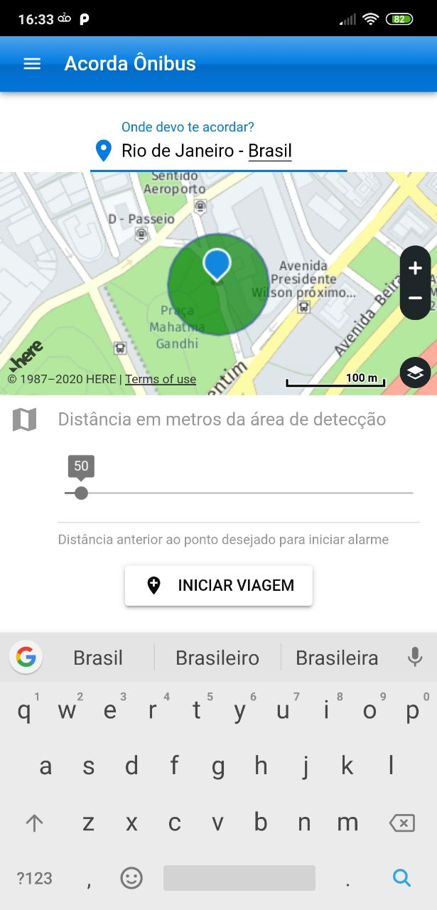
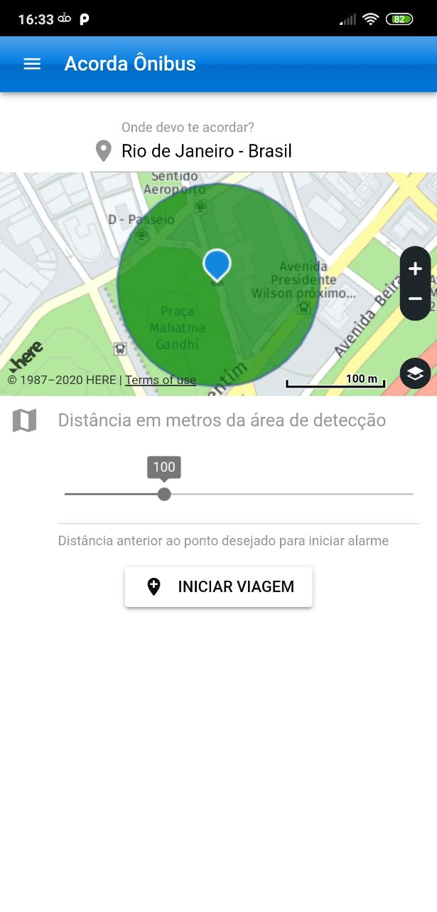
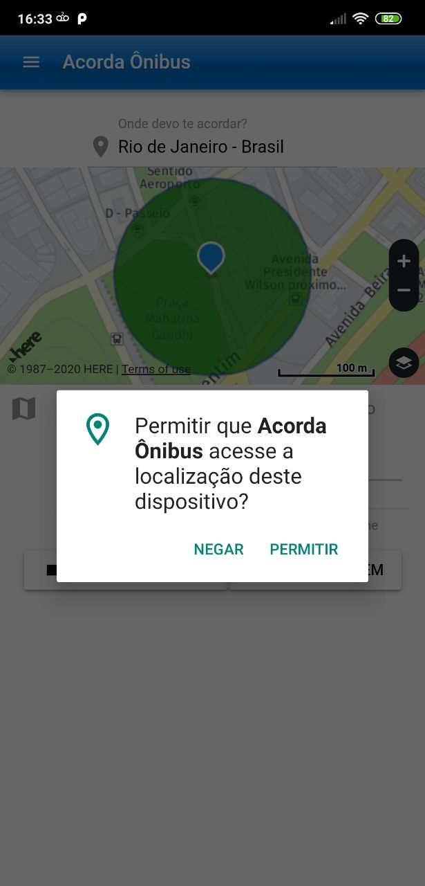
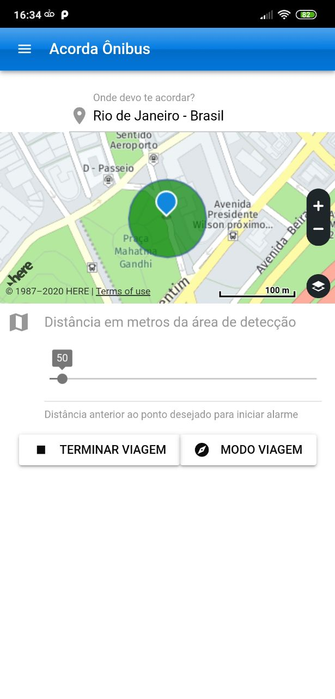

# Acorda Ônibus
The idea of this project is to persons who get sleep in bus and need little help to wakeup. This app ring alarm and vibrate the smartphone when the location is inside the range defined by the user.

### Technologies
* Quasar Framework v0.17
* Vue.JS 2.0
* Here Maps

### Build
* Web: quasar dev
* Mobile: quasar dev -m cordova -T [ios|android]

### Some Images
* 
* 
* 
* 
* 